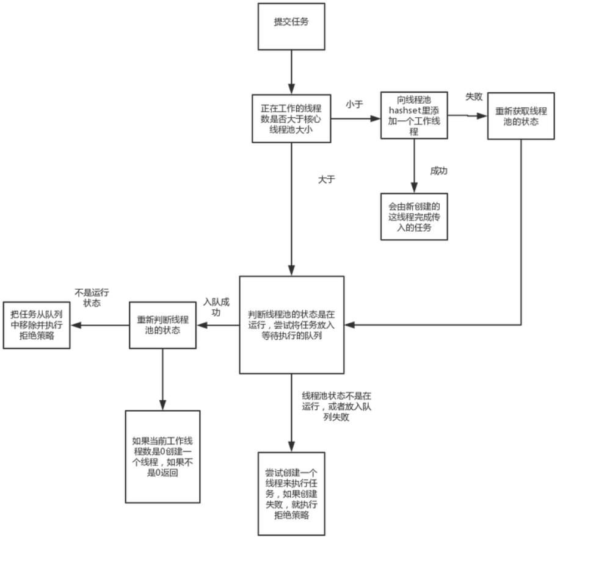

# **描述一个新的任务添加到线程池的过程**

这里可以看到有一个任务队列，然后还有一个工作的线程池。这个队列是用来干什么的呢？当我们提交的任务不能被及时执行的时候，可以入队列，等待被执行的。现在对于线程池的提交任务流程做一个简单的图解。主要以cachedThreadPool为例。

会被放到线程池的hashset中记录下来。
1.提交任务首先判断是否是null，如果是null就抛出空指针异常，如果不是执行2。
2.判断线程池中工作的线程数是否小于核心线程池的大小。如果小于执行 3,如果大于执行4
3.创建一个线程来执行提交的任务，如果失败重新获取线程池状态，然后执行4，成功就返回
4.判断线程池的状态是否在运行和尝试向把任务加入等待队列，如果线程池已经关闭或者放入等待队列失败，执行6。如果放入队列成功执行5
5.因为成功的入队了，我们需要重新判断线程池的状态，因为在放入队列的过程中线程池的状态可能会发生变化。如果发现线程池的状态不是在运行就将刚才添加的任务从队列中移除，然后执行拒绝策略。如果是在运行状态执行7
6.尝试创建一个线程来执行任务，如果创建线程失败就执行拒绝策略
7.判断当前的工作线程数是不是0如果不是就返回，如果是就创建一个线程！