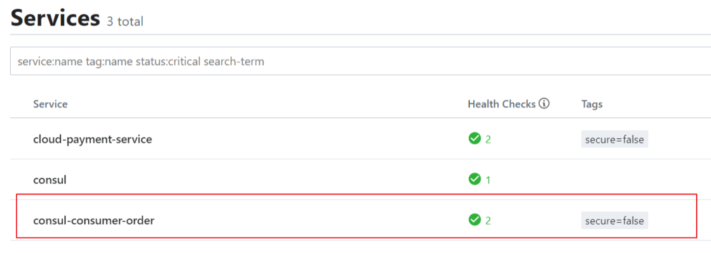

# 02、Consul服务注册与发现

# 一、Consul简介

[Consul官网](https://www.consul.io/intro/index.html) 

## 1、Consul是什么

Consul是一套开源的分布式服务发现和配置管理系统，有HashiCorp公司使用GO语言开发。


提供了微服务系统中的服务治理，配置中心，控制总线等功能，这些功能中的每一个都可以根据需要单独使用，也可以一起使用以架构全方位的服务网格，总之Consul提供了一种完整的服务网个解决方案。


它具有很多优点，包括：基于raft协议，比较简介；支持健康检查，同时支持Http和DNS协议 支持跨数据中心的WAN集群提供图形界面 跨平台，支持Linux，mac windows

## 2、Consul能干吗

- 服务发现
- 健康检测

- KV存储
- 多数据中心

- 可视化WEB界面


## 3、下载

[下载地址](https://www.consul.io/downloads.html) 

[学习地址](https://www.springcloud.cc/spring-cloud-consul.html) 


# 二、安装并运行Consul

下载windows后，解压后就一个文件 consul.exe 文件


在该目录下打开 cmd  输入   `consul --version` 就可以查看consul的版本


Consul 路径： D:\Program Files\Consul

启动consul：`consul agent -dev`

访问控制界面：http://localhost:8500

## 1、服务提供者

创建 cloud-providerconsul-payment8006 模块

### 1.1 添加依赖

```xml
<dependencies>
  <dependency>
    <groupId>org.springframework.cloud</groupId>
    <artifactId>spring-cloud-starter-consul-discovery</artifactId>
  </dependency>

  <dependency>
    <groupId>com.yixuexi.springcloud</groupId>
    <artifactId>cloud-api-commons</artifactId>
    <version>${project.version}</version>
  </dependency>


  <dependency>
    <groupId>org.springframework.boot</groupId>
    <artifactId>spring-boot-starter-web</artifactId>
  </dependency>

  <dependency>
    <groupId>org.springframework.boot</groupId>
    <artifactId>spring-boot-starter-actuator</artifactId>
  </dependency>

  <dependency>
    <groupId>org.springframework.boot</groupId>
    <artifactId>spring-boot-devtools</artifactId>
    <scope>runtime</scope>
    <optional>true</optional>
  </dependency>

  <dependency>
    <groupId>org.projectlombok</groupId>
    <artifactId>lombok</artifactId>
    <optional>true</optional>
  </dependency>

  <dependency>
    <groupId>org.springframework.boot</groupId>
    <artifactId>spring-boot-starter-test</artifactId>
    <scope>test</scope>
  </dependency>
</dependencies>
```

### 1.2 写yaml

```yaml
server:
  port: 8006
spring:
  application:
    name: cloud-payment-service
  cloud:
    consul:
      host: localhost
      port: 8500
      discovery:
        service-name: ${spring.application.name}
```

### 1.3 主启动类

```java
@EnableDiscoveryClient
@SpringBootApplication
public class ConsulMain8006 {
    public static void main(String[] args) {
        SpringApplication.run(ConsulMain8006.class,args);
    }
}
```

1.4 业务类

```java
@RestController
public class PaymentController {
    @Value("${server.port}")
    private String port;

    @RequestMapping("/get/Payment/{id}")
    public CommonResult get(@PathVariable Long id){

        return new CommonResult(200,"",port);
    }
}
```

### 1.4 测试


## 2、服务消费者

创建 cloud-consumerconsul-order80 模块

### 2.1 添加依赖

```xml
<dependencies>
  <dependency>
    <groupId>org.springframework.cloud</groupId>
    <artifactId>spring-cloud-starter-consul-discovery</artifactId>
  </dependency>

  <dependency>
    <groupId>com.yixuexi.springcloud</groupId>
    <artifactId>cloud-api-commons</artifactId>
    <version>1.0-SNAPSHOT</version>
  </dependency>


  <dependency>
    <groupId>org.springframework.boot</groupId>
    <artifactId>spring-boot-starter-web</artifactId>
  </dependency>

  <dependency>
    <groupId>org.springframework.boot</groupId>
    <artifactId>spring-boot-starter-actuator</artifactId>
  </dependency>

  <dependency>
    <groupId>org.springframework.boot</groupId>
    <artifactId>spring-boot-devtools</artifactId>
    <scope>runtime</scope>
    <optional>true</optional>
  </dependency>

  <dependency>
    <groupId>org.projectlombok</groupId>
    <artifactId>lombok</artifactId>
    <optional>true</optional>
  </dependency>

  <dependency>
    <groupId>org.springframework.boot</groupId>
    <artifactId>spring-boot-starter-test</artifactId>
    <scope>test</scope>
  </dependency>
</dependencies>
```

### 2.2 yaml

```yaml
server:
  port: 80


spring:
  application:
    name: consul-consumer-order
  cloud:
    consul:
      host: localhost
      port: 8500
      discovery:
        service-name: ${spring.application.name}
```

### 2.3 主启动类

```java
@SpringBootApplication
@EnableDiscoveryClient
public class OrderConsulMain80 {
    public static void main(String[] args) {
        SpringApplication.run(OrderConsulMain80.class,args);
    }
}
```

### 2.4 配置类

添加 RestTemplate 组件

```java
@Configuration
public class MyConfig {

    @LoadBalanced
    @Bean
    public RestTemplate restTemplate(){
        return new RestTemplate();
    }
}
```

### 2.5 业务类

远程调用的业务类

```java
@RestController
public class PaymentController {

    @Autowired
    private RestTemplate restTemplate;

    @RequestMapping("/consumer/get/payment/{id}")
    public CommonResult<Payment> get(@PathVariable("id") Long id){
        String url = "http://cloud-payment-service/get/payment/" + id;

        return restTemplate.getForObject(url,CommonResult.class);
    }

}
```

### 2.6 测试




# 三、三个注册中心异同点

## 1、 CAP 概念

C：Consistency  强一致性

A：Availability 可用性

P：Partition tolerance 分区容错

CAP 理论关注粒度是数据，而不是整体系统设计的策略。


## 2、经典CAP图

最多只能同时较好的满足两个

CAP理论的核心是：一个分布式系统不可能同时很好的满足一致性，可用性和分区容错性着三个需求，因此根据CAP原理将NoSQL数据库分成了满足CA原则，满足CP原则和满足AP原则三大类：

- CA-单点集群 满足一致性，可用性的系统，通常在可拓展性上不太强大。
- CP-满足一致性，分区容忍比的系统，通常性能不是特别高。

- AP-满足可用性，分区容忍性的系统，通常可能对一致性要求低一些。


### 2.1 AP架构（Eureka）

当网络分区出现后，为了保证可用性，系统B可以返回旧值，保证系统的可用性。

结论：违背了一致性C的要求，只满足可用性和分区容错，即AP


### 2.2 CP架构

当网络分区出现后，为了保证一致性，就必须拒接请求，否则无法保证一致性

结论：违背了可用性A的要求，只满足一致性和分区容错，即CP

